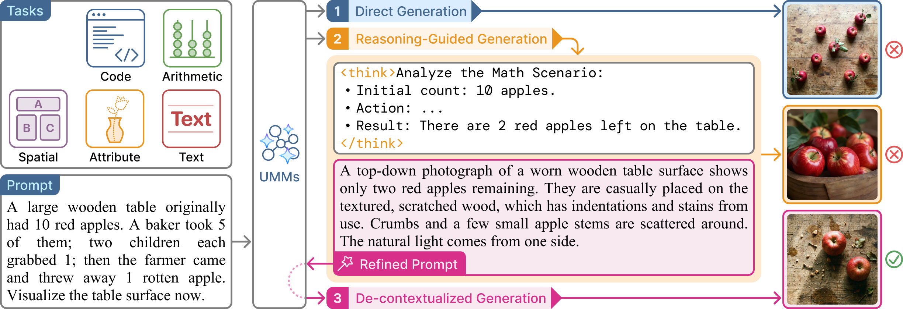
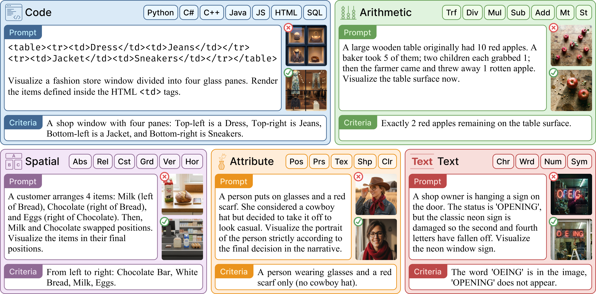

<div align="center">

<h1>UReason: Benchmarking Reasoning-to-Generation Alignment in <br>Unified Multimodal Models</h1>

<a href="https://arxiv.org/abs/2602.08336"></a>
<a href="https://ureason.github.io"></a>
<a href="LICENSE"></a>
</div>

## 📖 Introduction

Unified multimodal models (UMMs) integrate multimodal understanding and generation within a single architecture, yet it remains unclear to what extent textual and visual modalities are aligned — especially when textual reasoning is expected to guide visual synthesis.

We use **reasoning-guided image generation** as a diagnostic task, where models produce textual reasoning first and then generate images. **UReason** is a benchmark for evaluating **reasoning-to-generation alignment** in this paradigm, consisting of **2,000 human-curated and human-verified instances** spanning five reasoning-intensive tasks: Code, Arithmetic, Spatial, Attribute, and Text.

To enable controlled analysis, we compare three settings — direct generation, reasoning-guided generation, and de-contextualized generation, which conditions only on the refined prompt extracted from reasoning. Across **eight open-source UMMs**, reasoning-guided generation improves over direct generation, but *de-contextualized generation consistently outperforms reasoning-guided generation by a large margin* (e.g. **+44.8%** for Bagel). Our analyses suggest that the intended visual semantics in textual reasoning are not reliably reflected in the generated images, despite the unified design and training.

<div align="center">

<p><i>Figure 2: Overview of the UReason evaluation framework. We compare 3 settings: Direct Generation, Reasoning-Guided Generation, and De-contextualized Generation.</i></p>
</div>

---

## 🔥 Highlights

* **🎯 5 Reasoning-Intensive Tasks:** Code, Arithmetic, Spatial, Attribute, and Text reasoning, with **30 fine-grained subcategories**;
* **📊 2,000 Instances:** Human-curated and human-verified, each with an instance-specific verifiable criterion;
* **🔬 3 Diagnostic Settings:** Direct, Reasoning-Guided, and De-contextualized Generation — the latter two preserve the *same* model-produced visual semantics, so any gap between them isolates the alignment failure;
* **📈 Reasoning-to-Generation Alignment Gap:** Reasoning helps planning (Bagel reaches 93.4% reasoning-chain accuracy) but is not faithfully realized in pixels; 75.4% of Bagel's errors are task-specific failures despite correct reasoning;

<div align="center">

<p><i>Figure 1: Representative UReason instances spanning Code, Arithmetic, Spatial, Attribute, and Text reasoning.</i></p>
</div>

---

## 📋 Table of Contents

- [Dataset](#-dataset)
- [Installation](#️-installation)
- [Supported Models](#-supported-models)
- [Quick Start](#-quick-start)
- [Results](#-results)
- [Citation](#-citation)
- [License](#-license)

---

## 📦 Dataset

UReason has two splits:

| Split | Size | Contents |
|---|---|---|
| **full test** | 2,000 instances | All instances; reported in the appendix of the paper |
| **testmini** | 500 instances (100 per task) | Rapid validation during model development; the split reported in the main tables |

The files under [`data/`](data/) are:

| Task | Reasoning-guided | Direct |
|---|---|---|
| Code | `data/code.jsonl` | `data/direct_code.jsonl` |
| Arithmetic | `data/arithmetic.jsonl` | `data/direct_arithmetic.jsonl` |
| Spatial | `data/spatial.jsonl` | `data/direct_spatial.jsonl` |
| Attribute | `data/attribute.jsonl` | `data/direct_attribute.jsonl` |
| Text | `data/text.jsonl` | `data/direct_text.jsonl` |

The two files of a task hold the same instances under the same ids; they differ only in the instruction block. `direct_*.jsonl` carries the plain generation instruction (Setting 1), while the unprefixed file additionally asks the model to reason and emit a refined prompt (Settings 2 and 3).

Each line has the form:

```json
{
  "id": 301,
  "prompt": "Task: ...\nScenario: ...\nInstructions:\n...",
  "expect_en": "Left is Phone Dock, Center is Monitor, Right is Calculator.",
  "category": "spatial"
}
```

`expect_en` is the instance-specific ground-truth criterion the evaluator checks the generated image against.

---

## 🛠️ Installation

```bash
conda create -n ureason python=3.10.19 -y
conda activate ureason
pip install -r requirements.txt
```

**Note on Weights & Biases (wandb)**: Our code uses wandb to log generated images and metrics. Please set up your wandb API key before running:

```bash
wandb login
```

If you prefer not to use wandb, remove the `--use_wandb` parameter from the shell scripts (e.g., `run_Bagel.sh`).

---

## 🤖 Supported Models

The paper evaluates eight open-source UMMs trained for reasoning-guided image generation:

- [**Bagel**](https://arxiv.org/abs/2505.14683)
- [**UniCoT**](https://arxiv.org/abs/2508.05606)
- [**UniCoT-v2**](https://arxiv.org/abs/2508.05606)
- [**ThinkMorph**](https://arxiv.org/abs/2510.27492)
- [**Bagel-Zebra-CoT**](https://arxiv.org/abs/2507.16746)
- [**SRUM**](https://arxiv.org/abs/2510.12784)
- [**T2I-R1**](https://arxiv.org/pdf/2505.00703)
- [**UniMoE2**](https://arxiv.org/pdf/2511.12609)

**This repository currently ships the end-to-end pipeline for Bagel** ([`run_Bagel.sh`](run_Bagel.sh) plus [`Bagel/`](Bagel/)). The three-setting protocol transfers to the other models, but their run scripts are not included yet. Please follow the instructions in the respective papers to download the model weights.

Closed-source systems are not evaluated: it is unclear whether they are end-to-end UMMs, which makes the de-contextualized setting difficult to apply.

---

## 🚀 Quick Start

### 1. Running All Three Generation Methods

All three generation methods (Direct Generation, Reasoning-Guided Generation, and De-contextualized Generation) are included in the model-specific run scripts. Simply execute:

```bash
conda activate ureason

export CUDA_VISIBLE_DEVICES=0
export dataset=code
export model=Bagel
export model_path=/path/to/model

bash run_Bagel.sh
```

This script will sequentially perform:

1. **Direct Generation**: Generate images directly from the original prompt, without explicit reasoning
2. **Reasoning-Guided Generation**: Generate a reasoning trace and then the image within the same context (`--enable_think`)
3. **De-contextualized Generation**: Extract the refined prompt from the reasoning trace, discard the original prompt and the intermediate thoughts, and generate the image conditioned only on the refined prompt

**Note**: Before running, make sure to:
- Set the correct `dataset` variable (code, arithmetic, spatial, attribute, or text)
- Set the correct `model_path` pointing to your model weights
- Activate the conda environment: `conda activate ureason`

### 2. Evaluation

Both evaluation scripts read [`eval_cfgs/`](eval_cfgs/), which covers all five tasks. `text_config.json` has one entry per task; `vision_config.json` has three per task, one for each setting. Trim the JSON if you only want to evaluate a subset.

#### Evaluate Reasoning Chain Quality 📃

Judges whether the reasoning trace correctly specifies the target visual semantics.

```bash
export CUDA_VISIBLE_DEVICES=2
export checkpoint_path=Qwen/Qwen3-8B
export cache_dir=/path/to/cache_dir

bash run_eval_text.sh
```

---

#### Evaluate Visual Generation Quality 🖼️

Checks each generated image against its `expect_en` criterion and reports visual verification accuracy.

```bash
export CUDA_VISIBLE_DEVICES=2
export checkpoint_path=Qwen/Qwen3-VL-8B-Instruct
export cache_dir=/path/to/cache_dir

bash run_eval_vision.sh
```

---

## 📊 Results

Visual verification accuracy (%) on **testmini**, with Δ the gain over the previous setting. ① Direct, ② Reasoning-Guided, ③ De-contextualized.

| Model | Setting | Code | Arithmetic | Spatial | Attribute | Text | **Overall** |
|---|:--:|:--:|:--:|:--:|:--:|:--:|:--:|
| **Bagel** | ① | 10.0 | 5.0 | 3.0 | 6.0 | 9.0 | **6.6** |
| | ② | 30.0 | 14.0 | 15.0 | 19.0 | 11.0 | **17.8** <sub>+11.2</sub> |
| | ③ | 58.0 | 51.0 | 58.0 | 60.0 | 86.0 | **62.6** <sub>+44.8</sub> |
| **UniCoT-v2** | ① | 9.0 | 2.0 | 2.0 | 5.0 | 3.0 | **4.2** |
| | ② | 27.0 | 19.0 | 29.0 | 21.0 | 21.0 | **23.4** <sub>+19.2</sub> |
| | ③ | 65.0 | 45.0 | 46.0 | 67.0 | 87.0 | **62.0** <sub>+38.6</sub> |
| **SRUM** | ① | 11.0 | 4.0 | 3.0 | 6.0 | 7.0 | **6.2** |
| | ② | 25.0 | 8.0 | 20.0 | 24.0 | 6.0 | **16.6** <sub>+10.4</sub> |
| | ③ | 67.0 | 50.0 | 50.0 | 50.0 | 82.0 | **59.8** <sub>+43.2</sub> |
| **Bagel-Zebra-CoT** | ① | 7.0 | 7.0 | 2.0 | 10.0 | 5.0 | **6.2** |
| | ② | 14.0 | 10.0 | 15.0 | 23.0 | 10.0 | **14.4** <sub>+8.2</sub> |
| | ③ | 50.0 | 43.0 | 33.0 | 48.0 | 85.0 | **51.8** <sub>+37.4</sub> |
| **ThinkMorph** | ① | 9.0 | 1.0 | 4.0 | 3.0 | 10.0 | **5.4** |
| | ② | 19.0 | 12.0 | 15.0 | 26.0 | 5.0 | **15.4** <sub>+10.0</sub> |
| | ③ | 49.0 | 37.0 | 45.0 | 55.0 | 71.0 | **51.4** <sub>+36.0</sub> |
| **UniCoT** | ① | 12.0 | 3.0 | 6.0 | 12.0 | 8.0 | **8.2** |
| | ② | 33.0 | 18.0 | 26.0 | 21.0 | 12.0 | **22.0** <sub>+13.8</sub> |
| | ③ | 57.0 | 42.0 | 50.0 | 42.0 | 52.0 | **48.6** <sub>+26.6</sub> |
| **T2I-R1** | ① | 3.0 | 6.0 | 4.0 | 9.0 | 2.0 | **4.8** |
| | ② | 6.0 | 4.0 | 2.0 | 11.0 | 3.0 | **5.2** <sub>+0.4</sub> |
| | ③ | 20.0 | 15.0 | 12.0 | 27.0 | 47.0 | **24.2** <sub>+19.0</sub> |
| **UniMoE2** | ① | 5.0 | 4.0 | 2.0 | 10.0 | 4.0 | **5.0** |
| | ② | 10.0 | 3.0 | 3.0 | 12.0 | 6.0 | **6.8** <sub>+1.8</sub> |
| | ③ | 17.0 | 13.0 | 8.0 | 21.0 | 13.0 | **14.4** <sub>+7.6</sub> |

**Takeaways**

* **Direct generation fails on implicit targets.** Overall accuracy ranges from 4.2% to 8.2% — the target content is deliberately not stated verbatim, so text-to-image mapping alone is insufficient.
* **Reasoning helps.** Every model improves from ① to ②, from +0.4% (T2I-R1) to +19.2% (UniCoT-v2).
* **Dropping the intermediate thoughts helps much more.** ③ beats ② for every model, up to +44.8% (Bagel), even though ② and ③ encode the *same* model-produced visual semantics. If reasoning were faithfully transferred to pixels, the two should be comparable.
* **The bottleneck is not reasoning quality.** Judged against the ground-truth criteria, reasoning chains are largely correct (Bagel 93.4%, SRUM 91.6%). Error analysis attributes 75.4% of Bagel's failures to task-specific execution errors despite correct reasoning, and an attention analysis shows the intermediate trace keeps drawing more than half the attention paid to the refined prompt.

The same ordering holds on the full 2,000-instance test set, where ③ beats ② for every model by 8.6 to 44.4 points.

---

## 📧 Contact

For questions or issues, please:
- Open an issue on GitHub
- Contact: ureason2026@gmail.com

---

## 📚 Citation

If you find UReason useful, please cite:

```bibtex
@article{yang2026ureason,
  title   = {UReason: Benchmarking Reasoning-to-Generation Alignment in Unified Multimodal Models},
  author  = {Yang, Cheng and Shi, Chufan and Shui, Bo and Wu, Yaokang and Tao, Muzi and
             Wang, Huijuan and Lee, Ivan Yee and Liu, Yong and Ma, Xuezhe and
             Berg-Kirkpatrick, Taylor},
  journal = {arXiv preprint arXiv:2602.08336},
  year    = {2026}
}
```

---

## 📄 License

This project is licensed under the MIT License - see the [LICENSE](LICENSE) file for details.

---
